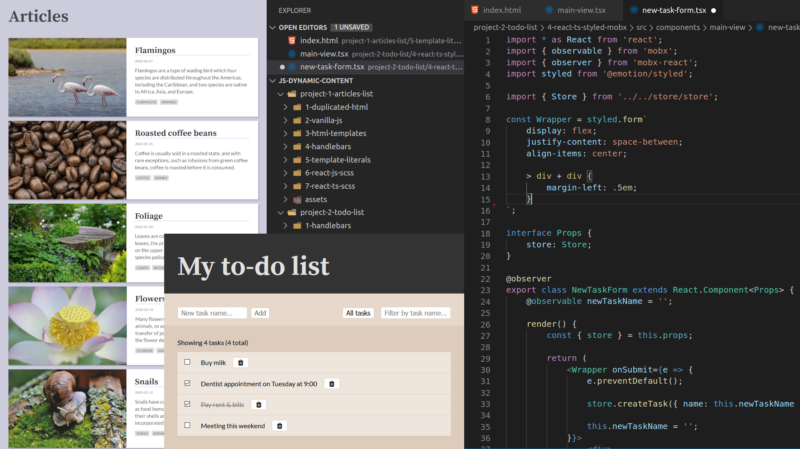
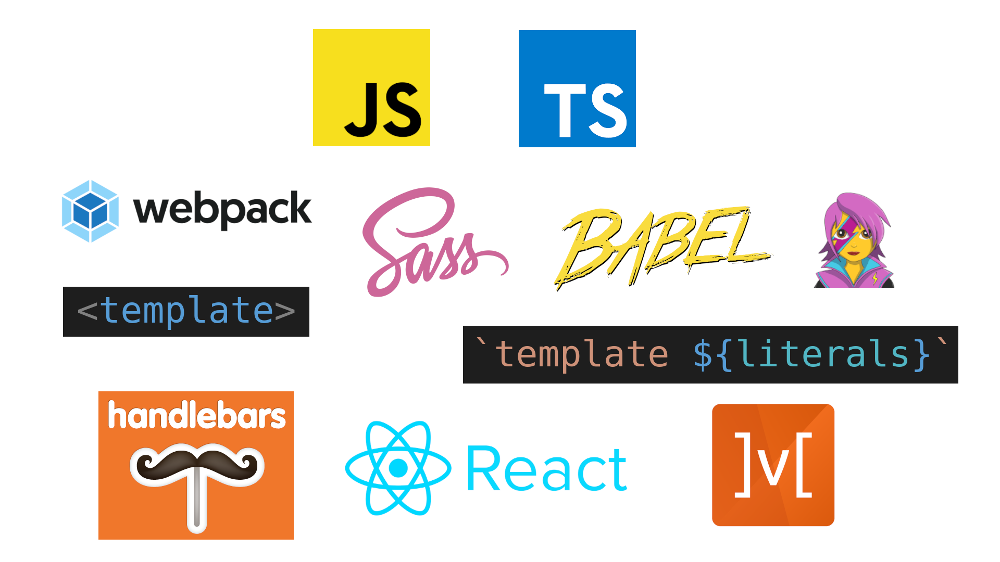

# Templates and state in JavaScript

- [Part 1: Dynamic content creation and templates](https://www.youtube.com/watch?v=VAzB-Okhp7g)
- Part 2: State management and modern front-end stack (video to be released)

## How to launch examples

1. In the console - `cd` to project folder and type `npx http-server -c-1 -p 3000`
2. In the browser - open `http://localhost:3000`
3. Examples that do not require build step (examples not using React) - just click on the folder name
4. Examples that require build step (examples using React):
    1. in the console - `cd` to example folder and `npm run build`
    2. in the browser - click on the folder name, then click on the `web` folder

